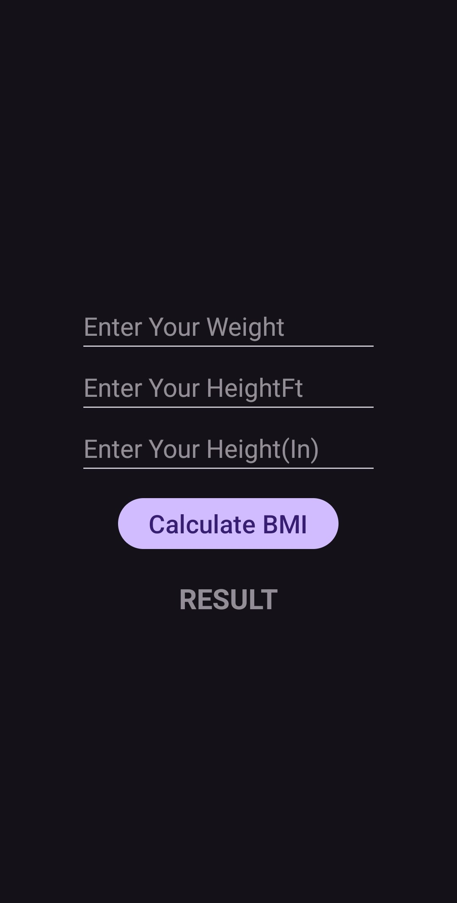

## 🧮 BMI Calculator App

A simple **BMI (Body Mass Index) Calculator** built using **Java** for the logic and **XML** for the user interface in Android Studio. This app allows users to enter their height and weight to calculate and display their BMI value along with a health category.

### 🚀 Features
- Input fields for height and weight
- Calculates BMI using standard formula
- Displays result with BMI category (Underweight, Healthy, Overweight)
- Clean and responsive UI built with XML

### 🛠️ Built With
- **Java** – Core application logic
- **XML** – Android UI layout
- **Android Studio** – Development environment

### 📱 Screenshot



### 📦 Getting Started
1. Clone this repo:
   ```bash
   git clone git@github.com:sakshiS004/BMI-Calculator.git
   ```
2. Open in Android Studio
3. Run the app on emulator or physical device

